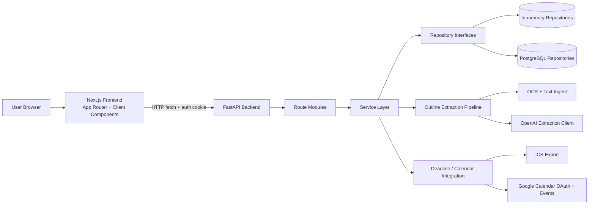
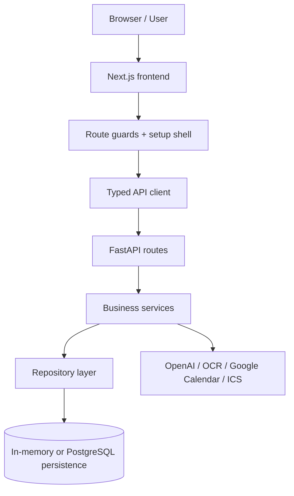
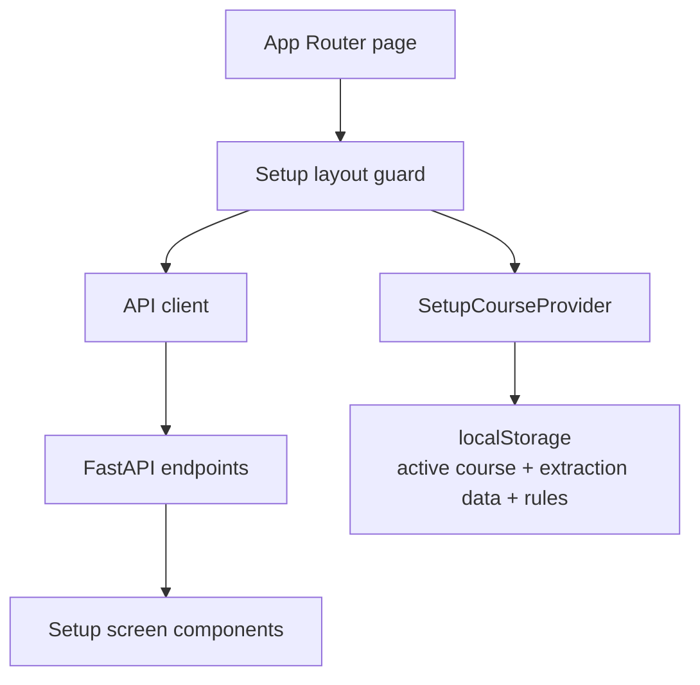
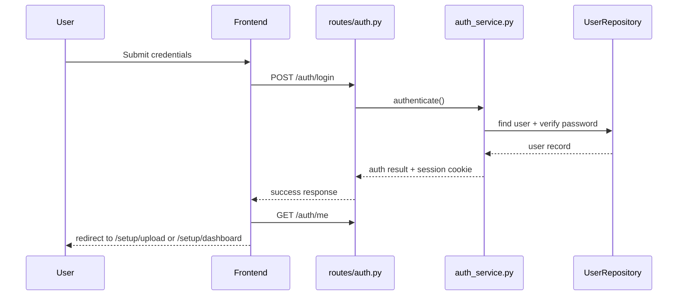
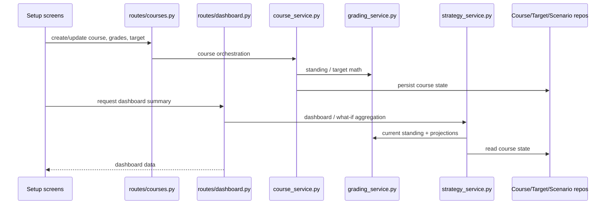
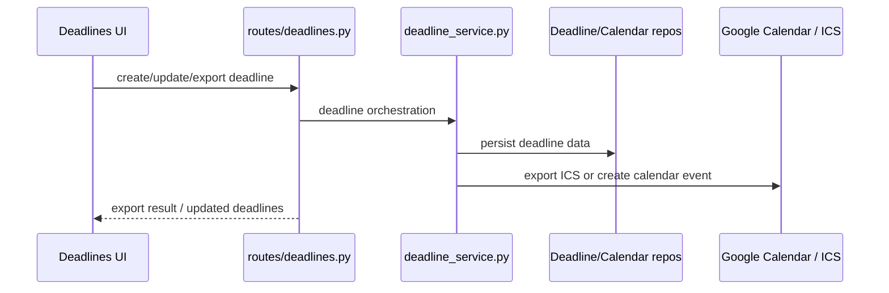
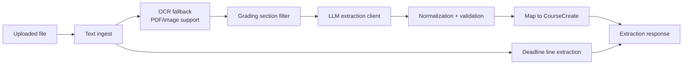
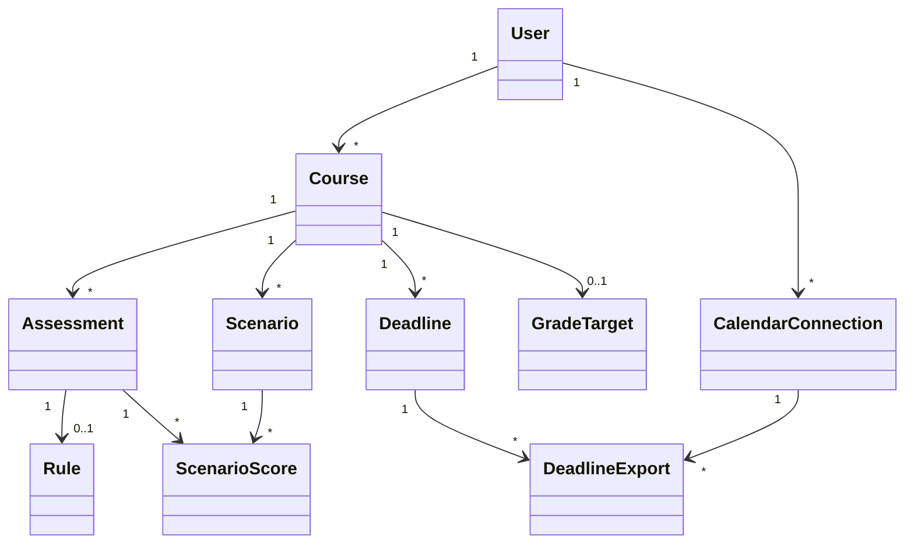

# Evalio Current Architecture

This document is the full working-project architecture for Evalio. It covers
the current end-to-end system across the entire codebase, not just the narrower
ITR3 submission view. The ITR3-focused document at
`docs/architecture/itr3-architecture-with-test-seams.md` is still useful for
iteration review, but this file is the main architecture source of truth for
the complete application.

## 1. System Overview

## 2. Full Product Capability Map

The current runtime combines all implemented project features into one shared
system:

- Authentication and session-backed access
  - registration
  - login/logout
  - current-user lookup
- Course workspace management
  - create/delete/list courses
  - active-course selection
  - multi-course isolation
- Course setup workflow
  - syllabus upload
  - outline extraction
  - manual structure editing
  - grade entry
  - target-goal configuration
  - deadline review/export
- Academic analytics and planning
  - dashboard current standing
  - minimum-required / target projections
  - multi-assessment what-if scenarios
  - risk alerts
  - weekly planning support
  - learning strategy suggestions
- GPA support
  - single-course GPA conversion
  - manual cGPA computation
  - normalized GPA scale conversion
- Integrations
  - OCR-assisted ingestion
  - OpenAI-powered extraction
  - ICS export
  - Google Calendar synchronization

## 3. End-to-End Runtime View

The working system is one connected application. All major GUI features pass
through the same architectural layers:

This means each implemented feature follows the same general lifecycle:

- the frontend route or component gathers user input
- the typed API client calls a FastAPI endpoint
- the route delegates to one or more services
- the service layer applies business rules and orchestration
- repositories read/write state
- some services additionally call external systems such as OCR, OpenAI, or
  Google Calendar
- the result is returned to the frontend and rendered in the setup workflow or
  related views

## 4. Frontend Architecture

The frontend is a Next.js App Router application in `frontend/src/app`.

### Route structure

- `/`: landing page
- `/login`: authentication screen
- `/setup/*`: main academic planning workflow
- `/explore`: standalone scenarios page wrapper

Current setup routes:

- `/setup/upload`
- `/setup/structure`
- `/setup/grades`
- `/setup/goals`
- `/setup/deadlines`
- `/setup/dashboard`
- `/setup/explore`
- `/setup/risk-center`
- `/setup/manage`
- `/setup/plan`

### Frontend responsibilities

- `frontend/src/app/layout.tsx`
  - defines the app-wide shell and metadata
- `frontend/src/app/providers.tsx`
  - mounts shared client-side providers used by the App Router tree
- `frontend/src/app/setup/layout.tsx`
  - acts as the setup-shell controller
  - checks auth state with `/auth/me`
  - loads courses with `/courses/`
  - redirects users between `/login`, `/setup/upload`, and `/setup/dashboard`
  - renders shared setup navigation and progress state
- `frontend/src/app/setup/course-context.tsx`
  - stores the active course ID in `localStorage`
  - stores course-scoped extraction results and grading rules in `localStorage`
  - exposes shared course context to setup screens
- `frontend/src/lib/api.ts`
  - centralizes all backend requests
  - resolves the backend base URL from `NEXT_PUBLIC_API_BASE_URL` or the local
    hostname
  - defines typed request/response shapes used across the app
- `frontend/src/lib/errors.ts`
  - normalizes frontend-readable error messages from API failures
- `frontend/src/components/setup/*`
  - implement the workflow screens for upload, structure, grades, goals,
    deadlines, dashboard, scenario exploration, risk review, GPA conversion,
    and course management
- `frontend/src/components/landing/*`
  - implement the landing-page wrapper and navigation outside the setup flow

### Frontend runtime flow

Important frontend implementation details:

- the App Router pages under `/setup/*` are intentionally thin wrappers around
  feature components in `frontend/src/components/setup/*`
- the setup shell and course context together provide continuity so the setup
  flow behaves like one application rather than disconnected pages

## 5. Backend Architecture

The backend is a FastAPI application rooted at `backend/app/main.py`.

### App composition

- `main.py`
  - loads `backend/.env`
  - configures CORS for local frontend origins
  - registers the API routers
  - exposes `/health`
- `dependencies.py`
  - builds singleton repositories and services at startup
  - switches between in-memory and PostgreSQL repository implementations
  - injects auth, course, extraction, deadline, scenario, planning, and GPA
    services

### Route modules

- `routes/auth.py`
  - register, login, logout, current-user checks
- `routes/courses.py`
  - course CRUD, weights, grades, targets, and minimum-required calculations
- `routes/dashboard.py`
  - dashboard summary, multi-assessment what-if, and strategy suggestions
- `routes/extraction.py`
  - outline extraction and extraction confirmation
- `routes/deadlines.py`
  - deadline extraction, CRUD, ICS export, and Google Calendar sync
- `routes/planning.py`
  - weekly planner and risk alerts
- `routes/scenarios.py`
  - saved scenario CRUD and scenario execution
- `routes/gpa.py`
  - GPA conversion, manual cGPA, and normalized scale-conversion endpoints

### Service layer

- `auth_service.py`
  - authentication and token-backed identity lookup
- `course_service.py`
  - course lifecycle orchestration
- `grading_service.py`
  - grade calculations, rules, targets, and projections
- `strategy_service.py`
  - dashboard what-if analysis and study strategy suggestions
- `gpa_service.py`
  - GPA and scale-conversion logic
- `deadline_service.py`
  - deadline extraction bridge, CRUD support, ICS export, Google Calendar sync
- `scenario_service.py`
  - saved-scenario validation, persistence, and execution
- `planning_service.py`
  - weekly planner and risk alert aggregation
- `services/extraction/`
  - modular outline extraction pipeline implementation

### Backend responsibility split

The backend follows a route -> service -> repository structure:

- route modules
  - enforce HTTP/API boundaries
  - validate request/response shapes
  - delegate business logic to services
- service layer
  - owns orchestration and domain rules
  - combines grading, planning, extraction, and calendar workflows
  - remains persistence-agnostic through repository abstractions
- repository layer
  - isolates data access
  - supports both in-memory and PostgreSQL implementations

## 6. Major Business Flows

### A. Authentication and setup entry

### B. Course setup and analytics flow

### C. Deadline and calendar flow

## 7. Extraction Pipeline

Outline extraction is no longer a single monolithic service. The implementation
is centered on `backend/app/services/extraction/orchestrator.py` plus helper
modules.

Pipeline characteristics:

- accepts `pdf`, `docx`, `txt`, and common image formats
- uses text extraction first, OCR when needed
- isolates grading-related text before LLM extraction
- validates and normalizes extracted assessments before returning them
- also scans source text for deadline candidates

## 8. Persistence Architecture

The runtime supports two persistence modes behind the same repository
interfaces.

### Repository selection

- default: in-memory repositories
- optional: PostgreSQL repositories when `USE_POSTGRES=true`
- optional fallback: `POSTGRES_FALLBACK_TO_MEMORY=true`

### Repository-backed domains

- users
- courses
- deadlines
- saved scenarios
- calendar connections
- grade targets

### PostgreSQL data model

The SQLAlchemy model layer in `backend/app/db.py` includes:

- `UserDB`
- `CourseDB`
- `AssessmentDB`
- `RuleDB`
- `ScenarioDB`
- `ScenarioScoreDB`
- `DeadlineDB`
- `CalendarConnectionDB`
- `GradeTargetDB`
- `AssessmentCategoryDB`
- `DeadlineExportDB`

These tables support both the course-planning core and the newer planning,
saved-scenario, and calendar export workflows.

### Persistence-related implementation notes

- in-memory repositories are useful for lightweight local execution and tests
- PostgreSQL repositories are the durable persistence implementation
- repository interfaces allow the same service layer to work across both modes
- SQLAlchemy models represent the durable relational view of the domain even
  when frontend-facing payloads remain simpler and more workflow-oriented

## 9. Current Domain Relationships

Important implementation detail:

- course operations still commonly address assessments by `name` at the API and
  service level, even though the PostgreSQL schema also has stable assessment
  UUIDs and saved scenarios can reference them directly

## 10. External Integrations

- OpenAI API
  - used by the extraction client for structured grading extraction
- OCR tooling
  - `tesseract` and `pdftoppm` are used for OCR-based fallback ingestion
- Google Calendar
  - OAuth2 authorization and event creation are handled in the deadline service
- ICS export
  - generated server-side for import into Google Calendar, Apple Calendar, or
    Outlook without third-party ICS libraries

## 11. Relationship to Iteration Documents

- `docs/architecture/itr3-architecture-with-test-seams.md`
  - submission-oriented architecture slice focused on ITR3 and test seams
- `docs/architecture/current-architecture.md`
  - whole-project architecture across the complete running system

## 12. Historical References

Older image-based diagrams are still present for iteration history, but they do
not fully reflect the current codebase:

- `docs/architecture/class diagram.png`
- `docs/architecture/itr1-architecture.png`
- `docs/ER diagram/erdiagram_evalio.png`

Use this document as the full current architecture reference during review and
submission.
