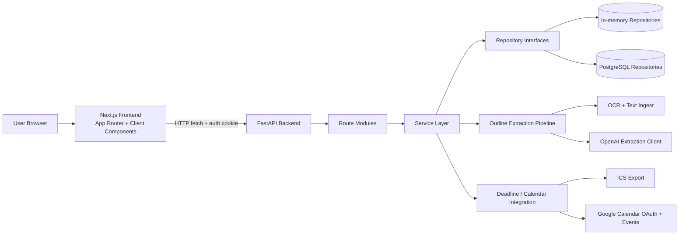
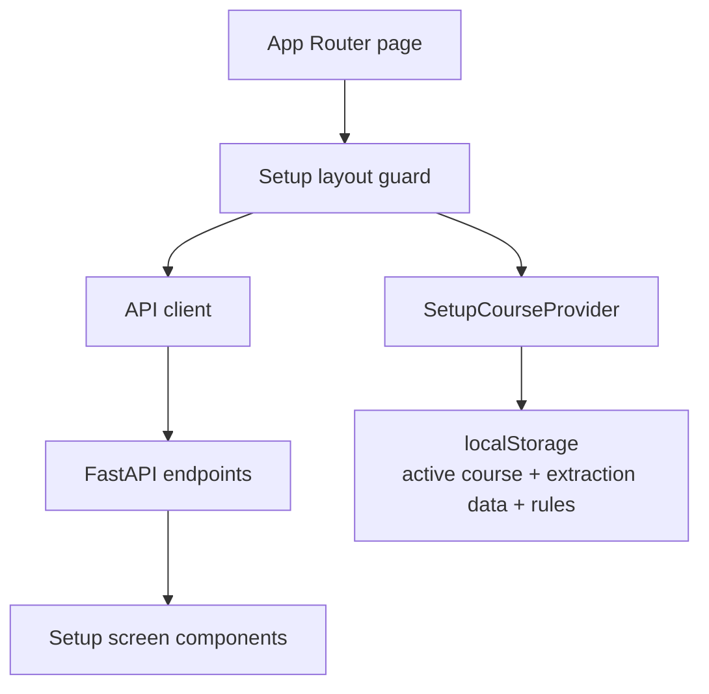
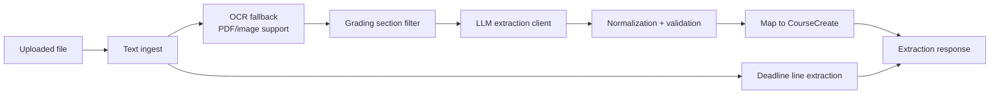
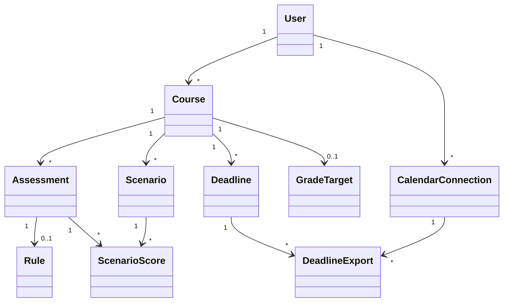

# Evalio Current Architecture

This document reflects the current implementation in the repository as of the
latest `main` branch state. It replaces the older high-level PNG references as
the primary architecture source of truth.

## 1. System Overview

## 2. Frontend Architecture

The frontend is a Next.js App Router application in `frontend/src/app`.

### Route structure

- `/`: landing page
- `/login`: authentication screen
- `/setup/*`: main academic planning workflow
- `/explore`: standalone scenarios page wrapper

Current setup routes:

- `/setup/upload`
- `/setup/structure`
- `/setup/grades`
- `/setup/goals`
- `/setup/deadlines`
- `/setup/dashboard`
- `/setup/explore`
- `/setup/risk-center`
- `/setup/manage`
- `/setup/plan`

### Frontend responsibilities

- `frontend/src/app/setup/layout.tsx`
  - acts as the setup-shell controller
  - checks auth state with `/auth/me`
  - loads courses with `/courses/`
  - redirects users between `/login`, `/setup/upload`, and `/setup/dashboard`
  - renders shared setup navigation and progress state
- `frontend/src/app/setup/course-context.tsx`
  - stores the active course ID in `localStorage`
  - stores course-scoped extraction results and grading rules in `localStorage`
  - exposes shared course context to setup screens
- `frontend/src/lib/api.ts`
  - centralizes all backend requests
  - resolves the backend base URL from `NEXT_PUBLIC_API_BASE_URL` or the local
    hostname
  - defines the typed request/response shapes used across the app
- `frontend/src/components/setup/*`
  - implement the workflow screens for upload, structure, grades, goals,
    deadlines, dashboard, scenario exploration, risk review, and course
    management

### Frontend runtime flow

## 3. Backend Architecture

The backend is a FastAPI application rooted at `backend/app/main.py`.

### App composition

- `main.py`
  - loads `backend/.env`
  - configures CORS for local frontend origins
  - registers the API routers
  - exposes `/health`
- `dependencies.py`
  - builds singleton repositories and services at startup
  - switches between in-memory and PostgreSQL repository implementations
  - injects auth, course, extraction, deadline, scenario, and planning services

### Route modules

- `routes/auth.py`: register, login, logout, current-user checks
- `routes/courses.py`: course CRUD, weights, grades, target, minimum-required,
  and single-assessment what-if
- `routes/dashboard.py`: dashboard summary, multi-assessment what-if, learning
  strategies
- `routes/extraction.py`: outline extraction and outline confirmation
- `routes/deadlines.py`: deadline extraction, CRUD, ICS export, Google Calendar
  OAuth/export
- `routes/planning.py`: weekly planner and risk alerts
- `routes/scenarios.py`: saved scenario CRUD and scenario execution
- `routes/gpa.py`: GPA conversion, manual cGPA, and normalized scale-conversion
  endpoints

### Service layer

- `auth_service.py`: authentication and token-backed identity lookup
- `course_service.py`: core course lifecycle orchestration
- `grading_service.py`: grade calculations, rules, targets, and projections
- `strategy_service.py`: multi-assessment what-if and study strategy suggestions
- `deadline_service.py`: deadline extraction bridge, CRUD support, ICS export,
  Google Calendar sync
- `scenario_service.py`: saved-scenario validation, persistence, and execution
- `planning_service.py`: weekly planner and risk alert aggregation
- `services/extraction/`: modular extraction pipeline implementation

## 4. Extraction Pipeline

Outline extraction is no longer a single monolithic service. The implementation
is centered on `backend/app/services/extraction/orchestrator.py` plus helper
mixins/modules.

Pipeline characteristics:

- accepts `pdf`, `docx`, `txt`, and common image formats
- uses text extraction first, OCR when needed
- isolates grading-related text before LLM extraction
- validates and normalizes extracted assessments before returning them
- also scans source text for deadline candidates

## 5. Persistence Architecture

The runtime supports two persistence modes behind the same repository
interfaces.

### Repository selection

- default: in-memory repositories
- optional: PostgreSQL repositories when `USE_POSTGRES=true`
- optional fallback: `POSTGRES_FALLBACK_TO_MEMORY=true`

### Repository-backed domains

- users
- courses
- deadlines
- saved scenarios
- calendar connections
- grade targets

### PostgreSQL data model

The SQLAlchemy model layer in `backend/app/db.py` includes:

- `UserDB`
- `CourseDB`
- `AssessmentDB`
- `RuleDB`
- `ScenarioDB`
- `ScenarioScoreDB`
- `DeadlineDB`
- `CalendarConnectionDB`
- `GradeTargetDB`
- `AssessmentCategoryDB`
- `DeadlineExportDB`

These tables support both the course-planning core and the newer planning,
saved-scenario, and calendar export workflows.

## 6. Current Domain Relationships

Important implementation detail:

- Course operations still commonly address assessments by `name` at the API and
  service level, even though the PostgreSQL schema also has stable assessment
  UUIDs and saved scenarios can reference them directly.

## 7. External Integrations

- OpenAI API
  - used by the outline extraction client for structured grading extraction
- OCR tooling
  - `tesseract` and `pdftoppm` are used for OCR-based fallback ingestion
- Google Calendar
  - OAuth2 authorization and event creation are handled in the deadline service
- ICS export
  - generated server-side for import into Google Calendar, Apple Calendar, or
    Outlook without third-party ICS libraries

## 8. Historical References

Older image-based diagrams are still present for iteration history, but they do
not fully reflect the current codebase:

- `docs/architecture/class diagram.png`
- `docs/architecture/itr1-architecture.png`
- `docs/ER diagram/erdiagram_evalio.png`

Use this document as the current architecture reference during review.
