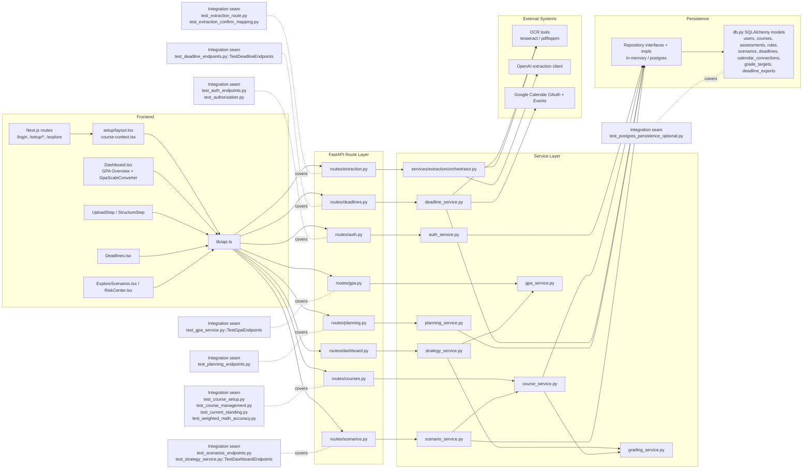

# Evalio ITR3 Architecture With Test Seams

This document is the ITR3-oriented architecture view for submission and review.
It focuses on the implemented runtime layers plus the integration seams covered
by backend integration tests.

Note: the repo uses a mix of pytest classes and function-based test modules. The
diagram labels a seam with the closest test class when one exists, otherwise the
test module filename is listed.

## Final Diagram

## Seam Notes

- Auth seam checks login, registration, cookie-backed identity, and access
  control boundaries.
- Course seam checks setup, grade updates, standing math, and multi-course
  isolation.
- GPA seam now covers:
  - single-course GPA
  - weighted manual cGPA
  - mandatory-pass failure behavior
  - normalized GPA scale conversion
- Extraction seam checks both outline extraction and confirmation/mapping into
  the course model.
- Deadline, planning, and scenario seams cover the newer ITR2/ITR3 workflow
  additions beyond the original course setup core.
